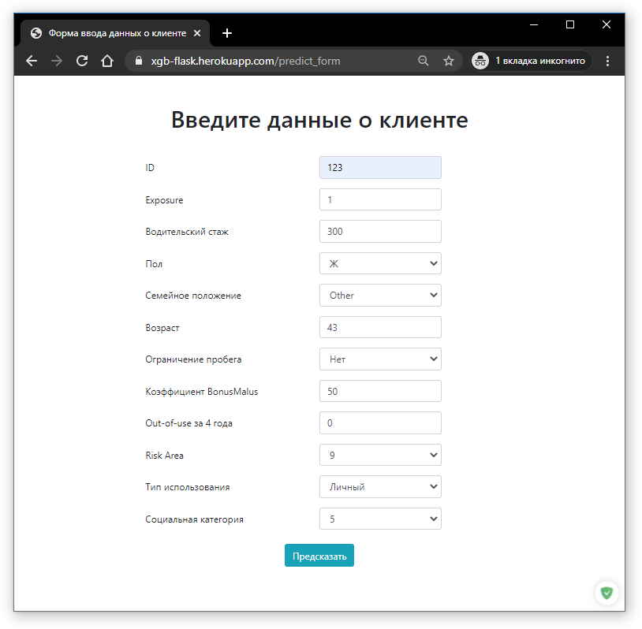
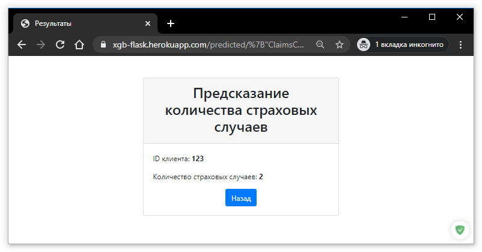

## Итоговое домашнее задание

Ссылка на веб-сервис https://xgb-flask.herokuapp.com

В качестве модели выбрана XGBoost модель из домашнего задания к предыдущему уроку для прогноза числа страховых случаев.

Пример использования:

